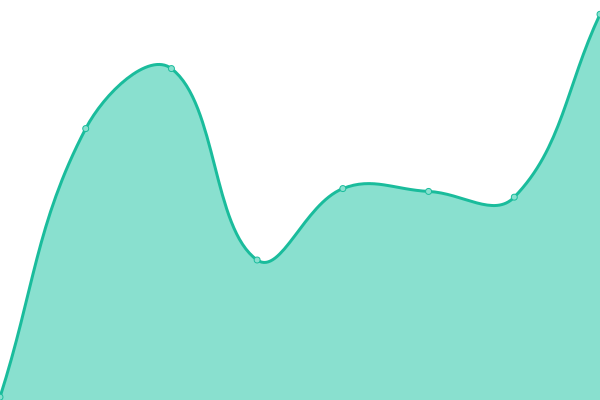
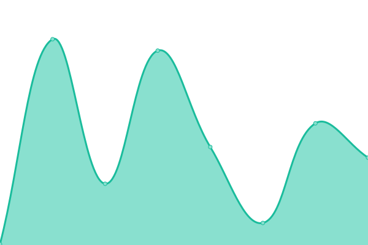

# [📈 Live Status](https://demo.upptime.js.org): <!--live status--> **🟧 Partial outage**

This repository contains the open-source uptime monitor and status page for [Upptime](https://upptime.js.org), powered by [Upptime](https://github.com/upptime/upptime).

With [Upptime](https://upptime.js.org), you can get your own unlimited and free uptime monitor and status page, powered entirely by a GitHub repository. We use [Issues](https://github.com/upptime/upptime/issues) as incident reports, [Actions](https://github.com/upptime/upptime/actions) as uptime monitors, and [Pages](https://demo.upptime.js.org) for the status page.

<!--start: status pages-->
<!-- This summary is generated by Upptime (https://github.com/upptime/upptime) -->
<!-- Do not edit this manually, your changes will be overwritten -->
<!-- prettier-ignore -->
| URL | Status | History | Response Time | Uptime |
| --- | ------ | ------- | ------------- | ------ |
|  [Google](https://www.google.com) | 🟩 Up | [google.yml](https://github.com/salomelai/Upptime/commits/HEAD/history/google.yml) | 

 68ms
     
 | 

<a href="https://demo.upptime.js.org/history/google">100.00%</a>
    

|  [Wikipedia](https://en.wikipedia.org) | 🟩 Up | [wikipedia.yml](https://github.com/salomelai/Upptime/commits/HEAD/history/wikipedia.yml) | 

 229ms
     
 | 

<a href="https://demo.upptime.js.org/history/wikipedia">100.00%</a>
    

|  [Hacker News](https://news.ycombinator.com) | 🟩 Up | [hacker-news.yml](https://github.com/salomelai/Upptime/commits/HEAD/history/hacker-news.yml) | 

 381ms
     
 | 

<a href="https://demo.upptime.js.org/history/hacker-news">100.00%</a>
    

|  [Test Broken Site](https://thissitedoesnotexist.koj.co) | 🟥 Down | [test-broken-site.yml](https://github.com/salomelai/Upptime/commits/HEAD/history/test-broken-site.yml) | 

 0ms
     
 | 

<a href="https://demo.upptime.js.org/history/test-broken-site">100.00%</a>
    

|  [Books](https://www.books.com.tw/) | 🟩 Up | [books.yml](https://github.com/salomelai/Upptime/commits/HEAD/history/books.yml) | 

 2895ms
     
 | 

<a href="https://demo.upptime.js.org/history/books">100.00%</a>
    

|  [Kingstone](https://www.kingstone.com.tw/) | 🟩 Up | [kingstone.yml](https://github.com/salomelai/Upptime/commits/HEAD/history/kingstone.yml) | 

 1717ms
     
 | 

<a href="https://demo.upptime.js.org/history/kingstone">99.84%</a>
    

|  [Sanmin](https://www.sanmin.com.tw/) | 🟩 Up | [sanmin.yml](https://github.com/salomelai/Upptime/commits/HEAD/history/sanmin.yml) | 

 12222ms
     
 | 

<a href="https://demo.upptime.js.org/history/sanmin">100.00%</a>
    

|  [CavesBooks](https://www.cavesbooks.com.tw/EC/) | 🟩 Up | [caves-books.yml](https://github.com/salomelai/Upptime/commits/HEAD/history/caves-books.yml) | 

 4348ms
     
 | 

<a href="https://demo.upptime.js.org/history/caves-books">99.84%</a>
    

|  [Bookwlker](https://www.bookwalker.com.tw/) | 🟩 Up | [bookwlker.yml](https://github.com/salomelai/Upptime/commits/HEAD/history/bookwlker.yml) | 

 2673ms
     
 | 

<a href="https://demo.upptime.js.org/history/bookwlker">100.00%</a>
    

|  [No this Site](https://www.bookwaker.com.tw/) | 🟥 Down | [no-this-site.yml](https://github.com/salomelai/Upptime/commits/HEAD/history/no-this-site.yml) | 

 0ms
     
 | 

<a href="https://demo.upptime.js.org/history/no-this-site">100.00%</a>
    

<!--end: status pages-->

[**Visit our status website →**](https://demo.upptime.js.org)

## 📄 License

- Powered by: [Upptime](https://github.com/upptime/upptime)
- Code: [MIT](./LICENSE) © [Upptime](https://upptime.js.org)
- Data in the `./history` directory: [Open Database License](https://opendatacommons.org/licenses/odbl/1-0/)
